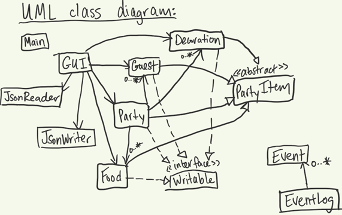

#  My Personal Project (Aariyana Sayani)

## Project Proposal - A Party Planner 

###  *Basic Idea: An application that will allow a user to plan their own party with all its accompanying aspects*

**Plan**: 
My plan is to create a Java Application that will allow a user plan their own party by inputting their own data (e.g. guest list, food, etc.).
The user will be able to add food to the list of food, guests to a guest list, give the party a theme, and other functionality.

**What will the application do?** 
The application will allow users to operate on aspects of a party. Users will be able to add
and remove guests from a guest list, decorations from a decor list, and other similar actions. Users will also be able to
categorize their items (e.g. snack, main course, wedding), and potentially filter on them. 

**Who will use it?** 
Anyone who wants to plan a party

**Why is this project of interest to me?** 
I have struggled with organization and planning all my life so something like this would have been helpful for me when I
was planning birthday parties with my mom when I was younger, because I was indecisive, so it would have been cool to be
able  to go back and change my mind as I please before finalizing everything. Additionally, when people are planning big
parties such as weddings, there can often be conflict between people, and also they often plan parties by making a bunch of
phone calls and having things on paper, so this would be a much more organized and efficient way to do the same thing digitally,
which would help when people call the places they need to book party things, because they'd have everything neatly laid
out in the app. 

### **User Stories**
***In the context of a Party Planner Application:***
- As a user, I want to be able to add an item (guest, food item, decoration, etc.) to its specified list
- As a user, I want to be able to remove an item from its specified list
- As a user, I want to be able to create a new party, with its own theme, guest list, etc.
- As a user, I want to be able to view my guest list, food list, etc.
- As a user, I want to be able to save the state of my party (including its guest, food and decor lists and all other
fields
- As a user, I want to be able to load my party from file (including the guest, food and decor lists)

###**Phase 4: Task 2**
Below is a sample event log that could be printed out when the user quits the app:

- Day Month Date HH:MM:SS PDT 2022 
  - New guest with known age was created.
- Day Month Date HH:MM:SS PDT 2022
  - New food item was created.
- Day Month Date HH:MM:SS PDT 2022
  - New decoration was created.
- Day Month Date HH:MM:SS PDT 2022
  - New party null party was created.
- Day Month Date HH:MM:SS PDT 2022
  - New party This occasion party was created.
- Day Month Date HH:MM:SS PDT 2022
  - New guest with known age was created.
- Day Month Date HH:MM:SS PDT 2022
  - First name Last name was added to the guest list.

###**Phase 4: Task 3**

***UML diagram:***

***Reflection: Is there anything I would change/refactoring?***

**How was this project for me?** This project was a good challenge for me, but very rewarding, exciting and fun. I enjoyed seeing the progress I made and
everything come together in every phase. The GUI was the most challenging, but it definitely peaked my interest into 
making future personal projects in Java, especially after talking with my TAs. With where I was at the beginning of the course,
I think it was just the right level for me, and now I'm ready to tackle something more. 

**What would I change?**
- For what I might change next time, one thing I might d is make different classes for each button in my GUI so that my code
is more organized. That would allow me to have multiple smaller classes that are used in my GUI class, rather than have one
immensely large GUI class that is over 500 lines of code long.

- Also, for all my remove functions (of guest, decor and food), they are currently selectable and scrollable, but selecting
selecting on them doesn't actually do anything. What I would do in the future is to make it so that once you select the song, 
you have the option to remove directly that way, rather than having to type in the prompted boxes, which would make the app
functionality more straightforward and user-friendly.

- Something else I might do, is make better use of my change decoration colour and change purchase status methods in the
food and decoration classes, so that when the user selects a specific item in the list, they have the option to change the
colour of the decoration or the purchase status of the food, rather than them having to delete the item entirely and add
it again with the updated status. This would increase user-friendliness as well.

- The last thing I think I might change is to figure out how to make my code more simple for me, by maybe not narrowing
my party items into specific separate lists, and making one single list of "party items", that way I can abstract out the
add and remove functionality into the abstract class of party item (like I did for toString), and that way make it less work
for myself.